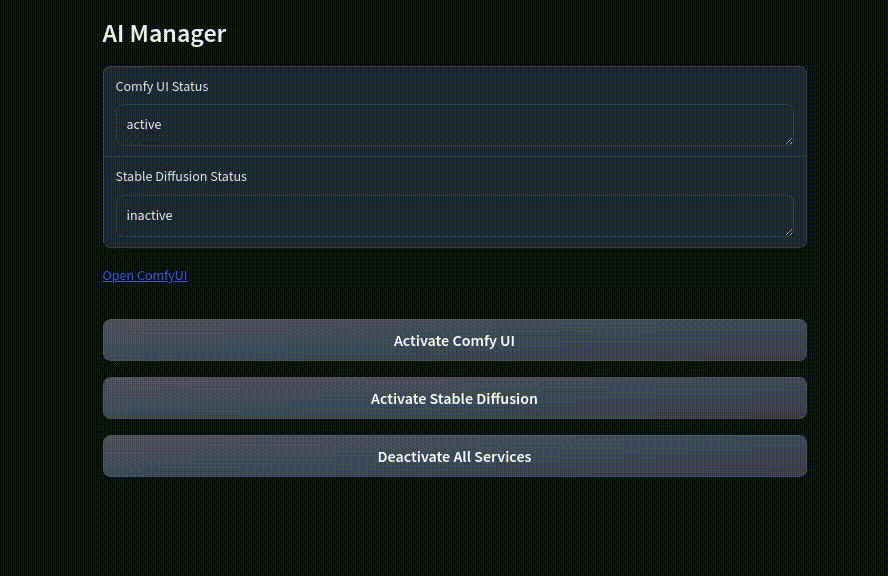

### Updated README Based on the Makefile:

# ComfyUI and Stable Diffusion Web UI Setup

This repository provides the necessary configuration files and a setup script to install and manage both ComfyUI and Stable Diffusion Web UI (AUTOMATIC1111) on your server. The setup includes systemd service files and an Nginx configuration for remote access.

## Table of Contents
- [Overview](#overview)
- [Installation](#installation)
- [Usage](#usage)
- [Configuration](#configuration)
- [Security](#security)
- [Internal Utilities](#internal-utilities)

## AI Manager App

## Overview
This repository automates the installation and configuration of ComfyUI, Stable Diffusion Web UI, and related services.

## Configuration
### Variables
Before running any of the Makefile commands, you may need to configure the following variables to suit your environment. These variables are located at the top of the Makefile:

- SD_WEBUI_REPO: URL of the Stable Diffusion Web UI repository. Default: https://github.com/AUTOMATIC1111/stable-diffusion-webui.git
- COMFYUI_REPO: URL of the ComfyUI repository. Default: https://github.com/comfyanonymous/ComfyUI.git
- APP_SOURCE_DIR: Directory path to the AI manager application source code. Default: ./ai_manager
- INSTALL_DIR: The directory where applications will be installed. Default: /opt/AI
- SERVER_NAME: The server name or domain to be configured in Nginx. Default: gpu2.watkinslabs.com
- SERVICE_USER: The user account that will manage the services. Default: ai-manager
- SERVICE_GROUP: The group that will have access to the services. Default: www-data
- To customize these variables, simply edit the values in the Makefile before running the setup commands.

## Installation
To install and set up everything, use the following command:
- the curent base dir is home/ai-manager/apps
- my server has a BIG partiotn for home.. not root so thats where I'm dumping this. You can change

### Main Command:
- `sudo make all`: This command will download, install, and build all necessary services and applications, including ComfyUI, Stable Diffusion Web UI, and associated configurations.

### Additional Installation:
- `sudo make install`: Install all the applications without setting up services.
- `sudo make setup`: Configure systemd services and Nginx.

### Services created

The following systemd services are set up as part of the installation:

- **AI-Manager Service**: 
  - **Service Name**: `ai_manager.service`
  - **Description**: This service manages the AI-Manager web application, which allows you to switch between Stable Diffusion and ComfyUI via the web interface.

- **Stable Diffusion Web UI Service**:
  - **Service Name**: `sdwebui.service`
  - **Description**: This service manages the Stable Diffusion Web UI (AUTOMATIC1111), enabling you to use Stable Diffusion via a web interface.

- **ComfyUI Service**:
  - **Service Name**: `comfyui.service`
  - **Description**: This service manages ComfyUI, another web interface for Stable Diffusion.

- **Nginx Service**:
  - **Service Name**: `nginx.service`
  - **Description**: This service handles the web server configuration, enabling remote access to the AI Manager, Stable Diffusion, and ComfyUI through a web interface.

These services are managed using systemd commands (`start`, `stop`, `enable`, `disable`) and can be controlled either via the command line or the AI Manager web interface.
## Usage

### From the Web Browser:
You can access the AI Manager interface through your web browser by navigating to the following URL:

- http://<your-server-address>/ai_manager

This web interface allows you to switch between Stable Diffusion Web UI and ComfyUI services, and manage the AI-Manager service.
Manage the services using the following commands:

### CLI:
- `make enable_ai_manager`: Enable `ai_manager` on boot.
- `make disable_ai_manager`: Disable the `ai_manager` service.
- `make start_ai_manager`: Start the `ai_manager` service.
- `make stop_ai_manager`: Stop the `ai_manager` service.
- `make enable_sdwebui`: Enable Stable Diffusion Web UI (and disable ComfyUI).
- `make enable_comfyui`: Enable ComfyUI (and disable Stable Diffusion Web UI).
- `make disable_services`: Disable both `sdwebui` and `comfyui` services.
- `make stop_services`: Stop all services.
- `make configure_nginx`: Configure Nginx with the specified `SERVER_NAME`.
- `make create_user_group`: Create the necessary user and group.
- `make create_sudoers_file`: Create a sudoers file for the service user.
- `make set_permissions`: Set permissions for the installation directory.

## Security

During the installation process, a user and group are created, and sudoers rules are set up to restrict access. The service user ai-manager is configured to only access service-related commands for the specific services installed (AI-Manager, Stable Diffusion Web UI, and ComfyUI). This ensures that the user has limited privileges, enhancing the security of the system.